# Kaggle Titanic Data Competition

### Objective - Predict who will survive based on the Titanic Dataset

#### Steps:
1. Read in Data Set
2. Combine the Train and Test Data
3. Data Prep (DC and FE)
4. Split data back into Train and Test Data
5. Split your train into train and test data
6. Define the algorithm
7. Fit your algorithm
8. Predict
9. Measure Accuracy and F1Score
10. Make Predictions on Kaggle 
11. Submit Results


```python
import numpy as np
from sklearn.cross_validation import train_test_split
import pandas as pd
import re
import matplotlib.pyplot as plt
%matplotlib inline
import seaborn as sns
from sklearn.metrics import accuracy_score, f1_score, recall_score, precision_score
```

    C:\Users\nwerner\AppData\Local\Continuum\Anaconda2\lib\site-packages\sklearn\cross_validation.py:41: DeprecationWarning: This module was deprecated in version 0.18 in favor of the model_selection module into which all the refactored classes and functions are moved. Also note that the interface of the new CV iterators are different from that of this module. This module will be removed in 0.20.
      "This module will be removed in 0.20.", DeprecationWarning)
    

### Load Data


```python
dfTest = pd.read_csv('test.csv') #418 Values
dfTrain = pd.read_csv('train.csv') #891 Values [0:891]
```


```python
df = dfTrain.append(dfTest)
df.info()
df.head()
```

    <class 'pandas.core.frame.DataFrame'>
    Int64Index: 1309 entries, 0 to 417
    Data columns (total 12 columns):
    Age            1046 non-null float64
    Cabin          295 non-null object
    Embarked       1307 non-null object
    Fare           1308 non-null float64
    Name           1309 non-null object
    Parch          1309 non-null int64
    PassengerId    1309 non-null int64
    Pclass         1309 non-null int64
    Sex            1309 non-null object
    SibSp          1309 non-null int64
    Survived       891 non-null float64
    Ticket         1309 non-null object
    dtypes: float64(3), int64(4), object(5)
    memory usage: 132.9+ KB
    


<div>
<style>
    .dataframe thead tr:only-child th {
        text-align: right;
    }

    .dataframe thead th {
        text-align: left;
    }

    .dataframe tbody tr th {
        vertical-align: top;
    }
</style>
<table border="1" class="dataframe">
  <thead>
    <tr style="text-align: right;">
      <th></th>
      <th>Age</th>
      <th>Cabin</th>
      <th>Embarked</th>
      <th>Fare</th>
      <th>Name</th>
      <th>Parch</th>
      <th>PassengerId</th>
      <th>Pclass</th>
      <th>Sex</th>
      <th>SibSp</th>
      <th>Survived</th>
      <th>Ticket</th>
    </tr>
  </thead>
  <tbody>
    <tr>
      <th>0</th>
      <td>22.0</td>
      <td>NaN</td>
      <td>S</td>
      <td>7.2500</td>
      <td>Braund, Mr. Owen Harris</td>
      <td>0</td>
      <td>1</td>
      <td>3</td>
      <td>male</td>
      <td>1</td>
      <td>0.0</td>
      <td>A/5 21171</td>
    </tr>
    <tr>
      <th>1</th>
      <td>38.0</td>
      <td>C85</td>
      <td>C</td>
      <td>71.2833</td>
      <td>Cumings, Mrs. John Bradley (Florence Briggs Th...</td>
      <td>0</td>
      <td>2</td>
      <td>1</td>
      <td>female</td>
      <td>1</td>
      <td>1.0</td>
      <td>PC 17599</td>
    </tr>
    <tr>
      <th>2</th>
      <td>26.0</td>
      <td>NaN</td>
      <td>S</td>
      <td>7.9250</td>
      <td>Heikkinen, Miss. Laina</td>
      <td>0</td>
      <td>3</td>
      <td>3</td>
      <td>female</td>
      <td>0</td>
      <td>1.0</td>
      <td>STON/O2. 3101282</td>
    </tr>
    <tr>
      <th>3</th>
      <td>35.0</td>
      <td>C123</td>
      <td>S</td>
      <td>53.1000</td>
      <td>Futrelle, Mrs. Jacques Heath (Lily May Peel)</td>
      <td>0</td>
      <td>4</td>
      <td>1</td>
      <td>female</td>
      <td>1</td>
      <td>1.0</td>
      <td>113803</td>
    </tr>
    <tr>
      <th>4</th>
      <td>35.0</td>
      <td>NaN</td>
      <td>S</td>
      <td>8.0500</td>
      <td>Allen, Mr. William Henry</td>
      <td>0</td>
      <td>5</td>
      <td>3</td>
      <td>male</td>
      <td>0</td>
      <td>0.0</td>
      <td>373450</td>
    </tr>
  </tbody>
</table>
</div>


### Feature Engineering


```python
# Create a Family Size Column off of SibSp and Parch
df['FamilySize'] = df['SibSp'] + df['Parch'] + 1

# Create a HasFamily Column from FamilySize (>0 or not)
df['HasFamily'] = df.FamilySize.apply(lambda x: 1 if x>1 else 0)

# Fill Cabin Null with 'Unknown' and then Strip 1st letter/character of Cabin to create groups
df.Cabin.fillna('Unknown', inplace=True)
df.Cabin = df.Cabin.apply(lambda x: x[0])
```


```python
title_dictionary = {
    'Mr': 'Mr',
    'Miss': 'Miss',
    'Mrs': 'Mrs',
    'Master': 'Master',
    'Dr': 'Officer',
    'Rev': 'Officer',
    'Col': 'Officer',
    'Mlle': 'Miss',
    'Ms': 'Mrs',
    'Major': 'Officer',
    'Sir': 'Royalty',
    'Dona': 'Royalty',
    'Jonkheer': 'Royalty',
    'the Countess': 'Royalty',
    'Capt': 'Officer',
    'Don': 'Royalty',
    'Lady': 'Royalty',
    'Mme': 'Mrs'    
}

df['Title'] = df['Name'].str.split(',').str[1]
df['Title'] = df['Title'].str.split('.').str[0]
df.Title = df.Title.str.strip()

df.Title = df.Title.map(title_dictionary)
```


```python
df.info()
```

    <class 'pandas.core.frame.DataFrame'>
    Int64Index: 1309 entries, 0 to 417
    Data columns (total 15 columns):
    Age            1046 non-null float64
    Cabin          1309 non-null object
    Embarked       1307 non-null object
    Fare           1308 non-null float64
    Name           1309 non-null object
    Parch          1309 non-null int64
    PassengerId    1309 non-null int64
    Pclass         1309 non-null int64
    Sex            1309 non-null object
    SibSp          1309 non-null int64
    Survived       891 non-null float64
    Ticket         1309 non-null object
    FamilySize     1309 non-null int64
    HasFamily      1309 non-null int64
    Title          1309 non-null object
    dtypes: float64(3), int64(6), object(6)
    memory usage: 163.6+ KB
    

### Fill Nulls


```python
# Replace (1) Null Fare Values with the Median of the Fair Values
df.Fare.fillna(df['Fare'].median(),inplace=True)

# Replace (2) Embarked Nulls with 'S'. 70% of people embarked from S
df.Embarked.fillna('S',inplace=True)
```


```python
groupTrain = df[:891].groupby(['Sex','Pclass','Title']).median()['Age']
groupTest = df[891:].groupby(['Sex', 'Pclass', 'Title']).median()['Age']
groupTrain
```


    Sex     Pclass  Title  
    female  1       Miss       30.0
                    Mrs        40.0
                    Officer    49.0
                    Royalty    40.5
            2       Miss       24.0
                    Mrs        31.5
            3       Miss       18.0
                    Mrs        31.0
    male    1       Master      4.0
                    Mr         40.0
                    Officer    51.0
                    Royalty    40.0
            2       Master      1.0
                    Mr         31.0
                    Officer    46.5
            3       Master      4.0
                    Mr         26.0
    Name: Age, dtype: float64


```python
def fillAge(row, group):
    
    if (row['Sex'] == 'female') & (row['Pclass'] == 1):
        if row['Title'] == 'Miss':
            return group.loc['female', 1, 'Miss']
        elif row['Title'] == 'Mrs':
            return group.loc['female', 1, 'Mrs']
        elif row['Title'] == 'Officer':
            return group.loc['female', 1, 'Officer']
        elif row['Title'] == 'Royalty':
            return group.loc['female', 1, 'Royalty']
    
    elif (row['Sex'] == 'female') & (row['Pclass'] == 2):
        if row['Title'] == 'Miss':
            return group.loc['female', 2, 'Miss']
        elif row['Title'] == 'Mrs':
            return group.loc['female', 2, 'Mrs']
    
    elif (row['Sex'] == 'female') & (row['Pclass'] == 3):
        if row['Title'] == 'Miss':
            return group.loc['female', 3, 'Miss']
        elif row['Title'] == 'Mrs':
            return group.loc['female', 3, 'Mrs']
    
    elif row['Sex']=='male' and row['Pclass'] == 1:
        if row['Title'] == 'Master':
            return group.loc['male', 1, 'Master']
        elif row['Title'] == 'Mr':
            return group.loc['male', 1, 'Mr']
        elif row['Title'] == 'Officer':
            return group.loc['male', 1, 'Officer']
        elif row['Title'] == 'Royalty':
            return group.loc['male', 1, 'Royalty']
        
    elif row['Sex']=='male' and row['Pclass'] == 2:
        if row['Title'] == 'Master':
            return group.loc['male', 2, 'Master']
        elif row['Title'] == 'Mr':
            return group.loc['male', 2, 'Mr']
        elif row['Title'] == 'Officer':
            return group.loc['male', 2, 'Officer']
        
    elif row['Sex']=='male' and row['Pclass'] == 3:
        if row['Title'] == 'Master':
            return group.loc['male', 3, 'Master']
        elif row['Title'] == 'Mr':
            return group.loc['male', 3, 'Mr']
        
        
df.iloc[:891].Age = df.iloc[:891].apply(lambda x : fillAge(x, groupTrain) if np.isnan(x['Age']) else x['Age'], axis=1) 
df.iloc[891:].Age = df.iloc[891:].apply(lambda x : fillAge(x, groupTest) if np.isnan(x['Age']) else x['Age'], axis=1)        
```

    C:\Users\nwerner\AppData\Local\Continuum\Anaconda2\lib\site-packages\pandas\core\generic.py:2999: SettingWithCopyWarning: 
    A value is trying to be set on a copy of a slice from a DataFrame.
    Try using .loc[row_indexer,col_indexer] = value instead
    
    See the caveats in the documentation: http://pandas.pydata.org/pandas-docs/stable/indexing.html#indexing-view-versus-copy
      self[name] = value
    


```python
# Create IsChild(Y/N) Category. IsChild if Age<=10
df.loc[df.Age<=10,'IsChild']=1
df.loc[df.Age>10,'IsChild']=0
```


```python
df.info()
```

    <class 'pandas.core.frame.DataFrame'>
    Int64Index: 1309 entries, 0 to 417
    Data columns (total 16 columns):
    Age            1309 non-null float64
    Cabin          1309 non-null object
    Embarked       1309 non-null object
    Fare           1309 non-null float64
    Name           1309 non-null object
    Parch          1309 non-null int64
    PassengerId    1309 non-null int64
    Pclass         1309 non-null int64
    Sex            1309 non-null object
    SibSp          1309 non-null int64
    Survived       891 non-null float64
    Ticket         1309 non-null object
    FamilySize     1309 non-null int64
    HasFamily      1309 non-null int64
    Title          1309 non-null object
    IsChild        1309 non-null float64
    dtypes: float64(4), int64(6), object(6)
    memory usage: 173.9+ KB
    

### Visual Data Exploration


```python
def plotStackedBars(xbars, ybars, df):
    
    plot_df = pd.DataFrame()
    
    for value in df[xbars].unique():
        x = df[df[xbars]==value][ybars].value_counts()
        plot_df = plot_df.append(x)
        
    plot_df.index = df[xbars].unique()
    
    return plot_df
```


```python
plotStackedBars('Sex','Survived',df).plot(kind='bar', stacked=True, rot=0, figsize=(10,5), color = ['Red','Green'])
```


    <matplotlib.axes._subplots.AxesSubplot at 0x6d05a20>


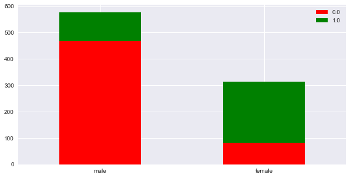


```python
# Want to see correlation of sex and survived on heatmap
d = {'female':1, 'male':0}
df.Sex = df.Sex.map(d)

corr = df.corr()

fig, ax = plt.subplots(figsize=(14,14))
sns.heatmap(corr, xticklabels=corr.columns.values, yticklabels=corr.columns.values, ax=ax, annot=True)
```


    <matplotlib.axes._subplots.AxesSubplot at 0x1dcb26d8>


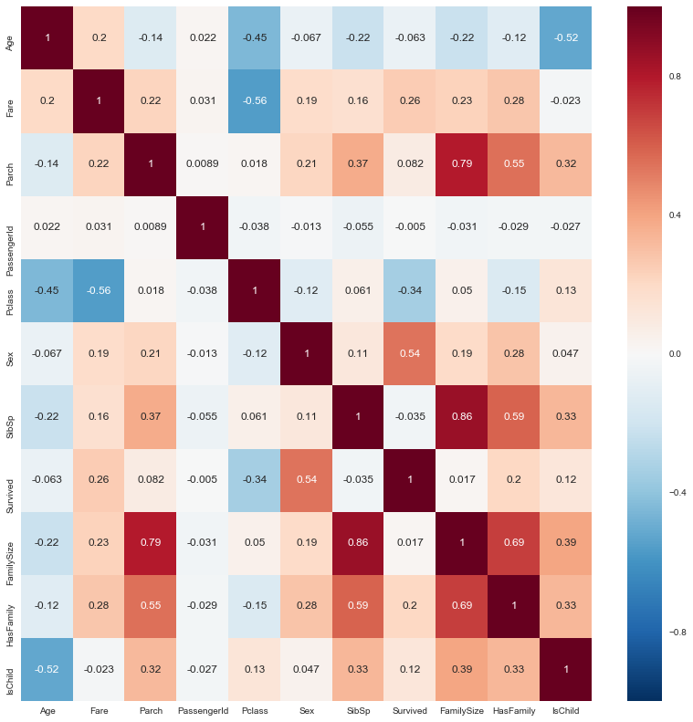


```python
df.HasFamily
```


    0      1
    1      1
    2      0
    3      1
    4      0
    5      0
    6      0
    7      1
    8      1
    9      1
    10     1
    11     0
    12     0
    13     1
    14     0
    15     0
    16     1
    17     0
    18     1
    19     0
    20     0
    21     0
    22     0
    23     0
    24     1
    25     1
    26     0
    27     1
    28     0
    29     0
          ..
    388    0
    389    1
    390    0
    391    1
    392    1
    393    0
    394    1
    395    1
    396    0
    397    1
    398    0
    399    0
    400    0
    401    1
    402    1
    403    0
    404    1
    405    0
    406    1
    407    1
    408    0
    409    1
    410    0
    411    1
    412    0
    413    0
    414    0
    415    0
    416    0
    417    1
    Name: HasFamily, Length: 1309, dtype: int64


#### Categorical Features


```python
plotStackedBars('Cabin','Survived',df).plot(kind='bar', stacked=True, rot=0, figsize=(10,5), color = ['Red','Green'])
```


    <matplotlib.axes._subplots.AxesSubplot at 0x1ddcb358>


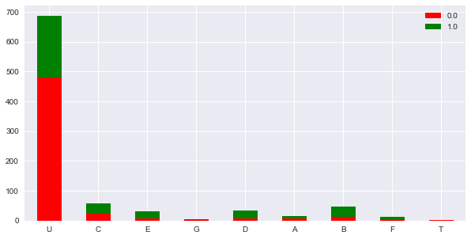


```python
plotStackedBars('Embarked','Survived',df).plot(kind='bar', stacked=True, rot=0, figsize=(10,5), color = ['Red','Green'])
```


    <matplotlib.axes._subplots.AxesSubplot at 0x20336be0>


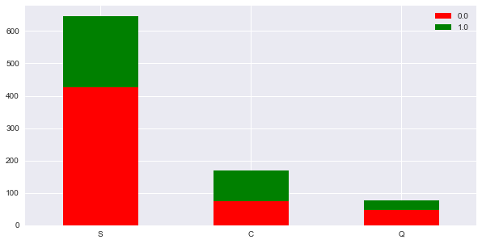


```python
plotStackedBars('Title','Survived',df).plot(kind='bar', stacked=True, rot=0, figsize=(10,5), color = ['Red','Green'])
```


    <matplotlib.axes._subplots.AxesSubplot at 0x20355550>


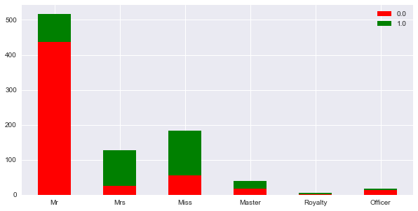


#### Highly Correlated Continuous Variables


```python
plotStackedBars('Pclass','Survived',df).plot(kind='bar', stacked=True, rot=0, figsize=(10,5), color = ['Red','Green'])
```


    <matplotlib.axes._subplots.AxesSubplot at 0x205677f0>


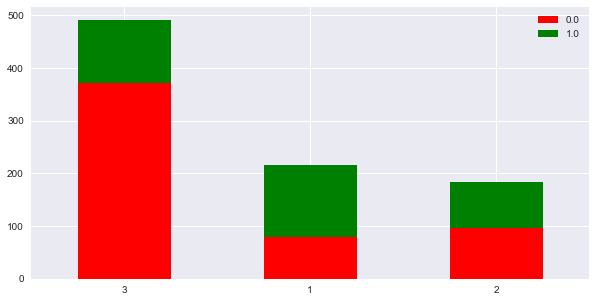


```python
fig = plt.figure(figsize=(10,6))
plt.hist([df[df['Survived'] == 0]['Fare'], df[df['Survived'] == 1]['Fare']], stacked=True, color= ['red', 'green'], bins=50)
plt.xlabel('Fare')
plt.ylabel('Number of Passengers')
plt.legend()
plt.show()
```

    C:\Users\nwerner\AppData\Local\Continuum\Anaconda2\lib\site-packages\matplotlib\axes\_axes.py:545: UserWarning: No labelled objects found. Use label='...' kwarg on individual plots.
      warnings.warn("No labelled objects found. "
    


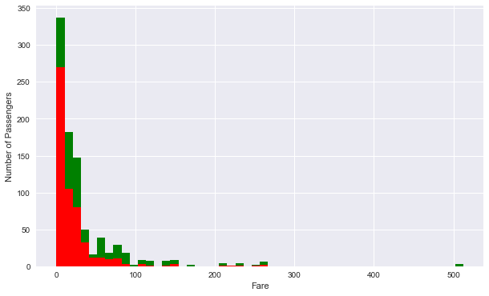


### Create Different Data Sets for Regression vs Tree Algorithms


```python
df = df.drop(['Ticket', 'PassengerId', 'Name'], axis=1)
```


```python
df = pd.get_dummies(df, columns = ['Cabin', 'Embarked', 'Pclass', 'Title'], drop_first=True)
```


```python
# Create (2) Copies of the dataframe. (1) for regression algorithms (1) for tree algorithms

df_reg = df.copy()
df_tree = df.copy()
```

#### Regression Algorithms


```python
print 'Skew for {a} is: {b}'.format(a='Age', b= df_reg.Age.skew())
print 'Skew for {a} is: {b}'.format(a='Fare', b= df_reg.Fare.skew())

fig = plt.figure(figsize=(10,10))

ax1 = plt.subplot(121)
ax2 = plt.subplot(122)

df_reg.hist(column='Age',ax=ax1)
df_reg.hist(column='Fare',ax=ax2)
```

    Skew for Age is: 0.513268914287
    Skew for Fare is: 4.36950955047
    


    array([<matplotlib.axes._subplots.AxesSubplot object at 0x0000000023108080>], dtype=object)


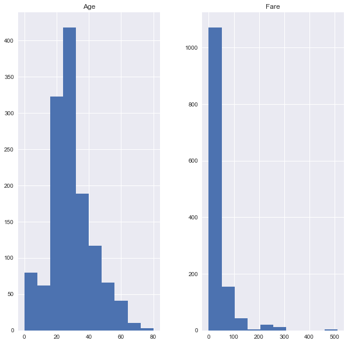


```python
logAge = np.log(df_reg.Age)
logFare = df_reg.Fare.apply(lambda x: np.log(x) if x!=0 else 0)

print 'Skew for {a} is: {b}'.format(a='Log(Age)', b= logAge.skew())
print 'Skew for {a} is: {b}'.format(a='Log(Fare)', b= logFare.skew())

fig = plt.figure(figsize=(10,10))

ax1 = plt.subplot(121)
ax2 = plt.subplot(122)

logAge.hist(ax=ax1)
logFare.hist(ax=ax2)
```

    Skew for Log(Age) is: -2.68722190291
    Skew for Log(Fare) is: 0.569434169491
    


    <matplotlib.axes._subplots.AxesSubplot at 0x234be6a0>


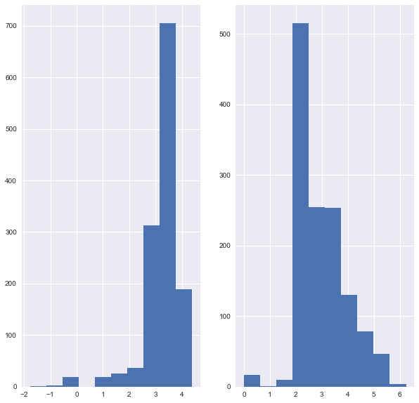


```python
df_reg['logFare'] = logFare
df_reg.drop('Fare', axis=1, inplace=True)
```

#### Tree Algorithms 


```python
df_tree['AgeBinned'] = pd.qcut(df_tree.Age, 10, labels=False)
df_tree['FareBinned'] = pd.qcut(df_tree.Fare, 10, labels=False)

df_tree.drop('Age', axis=1, inplace=True)
df_tree.drop('Fare', axis=1, inplace=True)
```

### Modeling


```python
dfTrain_reg = df_reg[0:891]
dfTrain_tree = df_tree[0:891]

dfFinalTest_reg = df_reg[891:]
dfFinalTest_tree = df_tree[891:]

dfFinalTest_reg.drop(['Survived'],axis=1,inplace=True) 
dfFinalTest_tree.drop(['Survived'],axis=1,inplace=True) 

dfyTrain_reg = dfTrain_reg['Survived']
dfyTrain_tree = dfTrain_tree['Survived']

dfXTrain_reg = dfTrain_reg.drop(['Survived'],axis=1)
dfXTrain_tree = dfTrain_tree.drop(['Survived'],axis=1)
```

    C:\Users\nwerner\AppData\Local\Continuum\Anaconda2\lib\site-packages\ipykernel_launcher.py:7: SettingWithCopyWarning: 
    A value is trying to be set on a copy of a slice from a DataFrame
    
    See the caveats in the documentation: http://pandas.pydata.org/pandas-docs/stable/indexing.html#indexing-view-versus-copy
      import sys
    C:\Users\nwerner\AppData\Local\Continuum\Anaconda2\lib\site-packages\ipykernel_launcher.py:8: SettingWithCopyWarning: 
    A value is trying to be set on a copy of a slice from a DataFrame
    
    See the caveats in the documentation: http://pandas.pydata.org/pandas-docs/stable/indexing.html#indexing-view-versus-copy
      
    


```python
X_train_reg, X_test_reg, y_train_reg,y_test_reg = train_test_split(dfXTrain_reg, dfyTrain_reg, train_size=0.8, random_state=0) 
X_train_reg.shape, y_train_reg.shape, X_test_reg.shape, y_test_reg.shape

X_train_tree, X_test_tree, y_train_tree,y_test_tree = train_test_split(dfXTrain_tree, dfyTrain_tree, train_size=0.8, random_state=0) 
X_train_tree.shape, y_train_tree.shape, X_test_tree.shape, y_test_tree.shape
```


    ((712, 25), (712L,), (179, 25), (179L,))


#### Logistic Regression


```python
from sklearn.linear_model import LogisticRegression

lr = LogisticRegression()
logmodel = lr.fit(X_train_reg, y_train_reg)
predictionLR = logmodel.predict(X_test_reg)

accScoreLR = accuracy_score(y_test_reg, predictionLR)
f1ScoreLR = f1_score(y_test_reg, predictionLR)
precisionScoreLR = precision_score(y_test_reg, predictionLR)
recallScoreLR = recall_score(y_test_reg, predictionLR)

print 'Logistic Regression Scores:'
print 'Accuracy Score:', accScoreLR
print 'F1 Score:', f1ScoreLR
print 'Precision Score:', precisionScoreLR
print 'Recall Score:', recallScoreLR
```

    Logistic Regression Scores:
    Accuracy Score: 0.826815642458
    F1 Score: 0.773722627737
    Precision Score: 0.779411764706
    Recall Score: 0.768115942029
    


```python
from sklearn.cross_validation import cross_val_score

def compute_score(clf, X, y, cv, scoring='accuracy'):
    xval = cross_val_score(clf, X, y, cv=cv, scoring=scoring)
    return np.mean(xval)
```


```python
compute_score(logmodel, X_train_reg, y_train_reg, 10, scoring='accuracy')
```


    0.82599262240107318


```python
from sklearn.metrics import confusion_matrix
import itertools

def plot_confusion_matrix(cm, classes, normalize=False, title='Confusion Matrix', cmap=plt.cm.Blues):

    # This function prints the confusion matrix
    # Normalization can be applied by setting it to true
    
    plt.imshow(cm, interpolation= 'nearest', cmap=cmap)
    plt.title(title)
    plt.colorbar()
    tick_marks = np.arange(len(classes))
    plt.xticks(tick_marks, classes, rotation=0)
    plt.yticks(tick_marks, classes)
    
    if normalize==True:
        cm = cm.astype(float)/cm.sum(axis=1)[:, np.newaxis]
        print 'Normalized Confusion Matrix'
    else:
        print 'Confusion Matrix without Normalization'
        
    print cm
    
    thresh = cm.max()/2
    for i, j in itertools.product(range(cm.shape[0]), range(cm.shape[1])):
        plt.text(j, i, cm[i,j], horizontalalignment='center', color='white' if cm[i,j] > thresh else 'black')
        
    plt.tight_layout()
    plt.ylabel('True Label')
    plt.xlabel('Predicted Label')
```


```python
cnf_matrix = confusion_matrix(y_test_reg, predictionLR)
np.set_printoptions(precision=2)

plt.figure()

class_names = ['Died', 'Survived']
plot_confusion_matrix(cnf_matrix, classes=class_names, normalize=True, title='Logistic Regression - Normalized Confusion Matrix')

plt.show()
```

    Normalized Confusion Matrix
    [[ 0.86  0.14]
     [ 0.23  0.77]]
    


```python
from sklearn.metrics import precision_recall_curve, average_precision_score

y_scoreLR = logmodel.decision_function(X_test_reg)
average_precision = average_precision_score(y_test_reg, y_scoreLR)

precision, recall, _ = precision_recall_curve(y_test_reg, y_scoreLR)

plt.step(recall, precision, color='b', alpha=0.2, where='post')
plt.fill_between(recall, precision, step='post', alpha=0.2, color='b')

plt.xlabel('Recall')
plt.ylabel('Precision')
plt.ylim([0.0, 1.05])
plt.xlim([0.0, 1.0])
plt.title('Logistic Regression - 2-class Precision-Recall curve: Average Precision = {0:0.2f}'.format(average_precision))
```


    <matplotlib.text.Text at 0x22c22d30>


```python
from sklearn import metrics

predsLR = logmodel.predict_proba(X_test_reg)[:,1]
fpr, tpr, _ =  metrics.roc_curve(y_test_reg, predsLR)

roc_auc = metrics.auc(fpr, tpr)

plt.title('Logistic Regression - Receiver Operating Characteristic')
plt.plot(fpr, tpr, 'b', label = 'AUC = %0.2f' % roc_auc)
plt.legend(loc = 'lower right')
plt.plot([0,1], [0,1], 'r--')
plt.xlim([0,1])
plt.ylim([0,1])
plt.ylabel('True Positive Rate')
plt.xlabel('False Positive Rate')
plt.show()
```


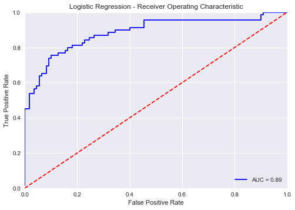


#### Gradient Boosting


```python
from sklearn.ensemble import GradientBoostingClassifier

clfGB = GradientBoostingClassifier(n_estimators=10)
clfGB = clfGB.fit(X_train_tree, y_train_tree)

predictionGB = clfGB.predict(X_test_tree)

accScoreGB = accuracy_score(y_test_tree, predictionGB)
f1ScoreGB = f1_score(y_test_tree, predictionGB)
precisionScoreGB = precision_score(y_test_tree, predictionGB)
recallScoreGB = recall_score(y_test_tree, predictionGB)

print 'Gradient Boosting Scores:'
print 'Accuracy Score:', accScoreGB
print 'F1 Score:', f1ScoreGB
print 'Precision Score:', precisionScoreGB
print 'Recall Score:', recallScoreGB
```

    Gradient Boosting Scores:
    Accuracy Score: 0.815642458101
    F1 Score: 0.755555555556
    Precision Score: 0.772727272727
    Recall Score: 0.739130434783
    


```python
compute_score(clfGB, X_train_tree, y_train_tree, 10, scoring='accuracy')
```


    0.8372607869438855


```python
cnf_matrix = confusion_matrix(y_test_tree, predictionGB)
np.set_printoptions(precision=2)

plt.figure()

class_names = ['Died', 'Survived']
plot_confusion_matrix(cnf_matrix, classes=class_names, normalize=True, title='Gradient Boosting - Normalized Confusion Matrix')

plt.show()
```

    Normalized Confusion Matrix
    [[ 0.86  0.14]
     [ 0.26  0.74]]
    


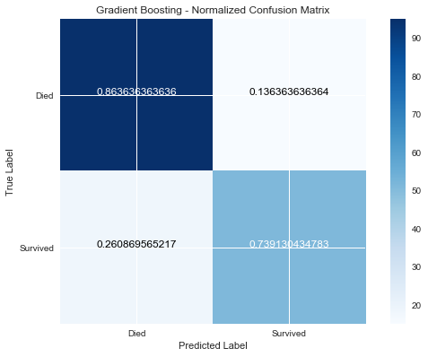


```python
y_scoreGB = clfGB.decision_function(X_test_tree)
average_precision = average_precision_score(y_test_tree, y_scoreGB)

precision, recall, _ = precision_recall_curve(y_test_reg, y_scoreGB)

plt.step(recall, precision, color='b', alpha=0.2, where='post')
plt.fill_between(recall, precision, step='post', alpha=0.2, color='b')

plt.xlabel('Recall')
plt.ylabel('Precision')
plt.ylim([0.0, 1.05])
plt.xlim([0.0, 1.0])
plt.title('Logistic Regression - 2-class Precision-Recall curve: Average Precision = {0:0.2f}'.format(average_precision))
```


    <matplotlib.text.Text at 0x24e1e3c8>


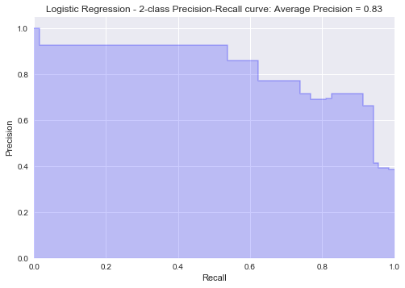


```python
predsGB = clfGB.predict_proba(X_test_tree)[:,1]
fpr, tpr, _ =  metrics.roc_curve(y_test_tree, predsGB)

roc_auc = metrics.auc(fpr, tpr)

plt.title('Gradient Boosting - Receiver Operating Characteristic')
plt.plot(fpr, tpr, 'b', label = 'AUC = %0.2f' % roc_auc)
plt.legend(loc = 'lower right')
plt.plot([0,1], [0,1], 'r--')
plt.xlim([0,1])
plt.ylim([0,1])
plt.ylabel('True Positive Rate')
plt.xlabel('False Positive Rate')
plt.show()
```


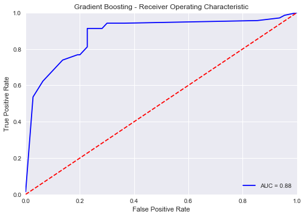


#### Random Forest


```python
from sklearn.ensemble import RandomForestClassifier

clfRF = RandomForestClassifier(n_estimators=10)
clfRF = clfRF.fit(X_train_tree, y_train_tree)

predictionRF = clfRF.predict(X_test_tree)

features = pd.DataFrame()
features['feature'] = dfXTrain_tree.columns
features['importance'] = clfRF.feature_importances_
features.sort_values(by=['importance'], ascending=True, inplace=True)
features.set_index('feature', inplace=True)

features.plot(kind='barh', figsize=(15, 15))
```


    <matplotlib.axes._subplots.AxesSubplot at 0x247aea58>


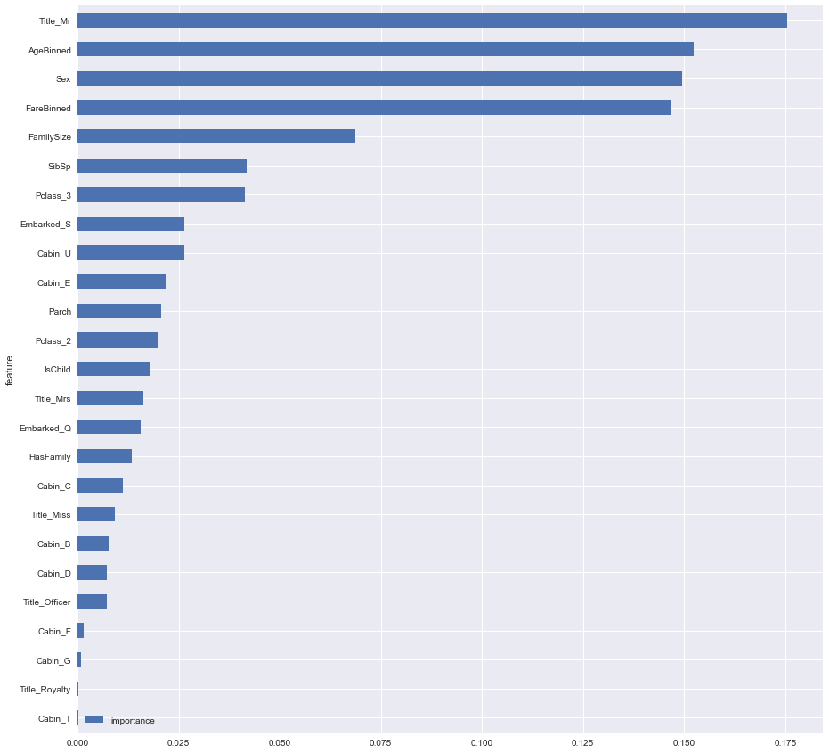


```python
accScoreRF = accuracy_score(y_test_tree, predictionRF)
f1ScoreRF = f1_score(y_test_tree, predictionRF)
precisionScoreRF = precision_score(y_test_tree, predictionRF)
recallScoreRF = recall_score(y_test_tree, predictionRF)

print 'Gradient Boosting Scores:'
print 'Accuracy Score:', accScoreRF
print 'F1 Score:', f1ScoreRF
print 'Precision Score:', precisionScoreRF
print 'Recall Score:', recallScoreRF
```

    Gradient Boosting Scores:
    Accuracy Score: 0.798882681564
    F1 Score: 0.71875
    Precision Score: 0.779661016949
    Recall Score: 0.666666666667
    


```python
compute_score(clfRF, X_train_tree, y_train_tree, 10, scoring='accuracy')
```


    0.78244634473507713


```python
cnf_matrix = confusion_matrix(y_test_tree, predictionRF)
np.set_printoptions(precision=2)

plt.figure()

class_names = ['Died', 'Survived']
plot_confusion_matrix(cnf_matrix, classes=class_names, normalize=True, title='Random Forest - Normalized Confusion Matrix')

plt.show()
```

    Normalized Confusion Matrix
    [[ 0.88  0.12]
     [ 0.33  0.67]]
    


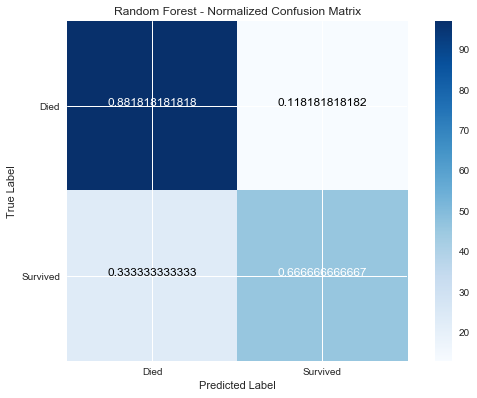


```python
'''y_scoreRF = clfRF.decision_function(X_test_tree)
average_precision = average_precision_score(y_test_tree, y_scoreRF)

precision, recall, _ = precision_recall_curve(y_test_reg, y_scoreRF)

plt.step(recall, precision, color='b', alpha=0.2, where='post')
plt.fill_between(recall, precision, step='post', alpha=0.2, color='b')

plt.xlabel('Recall')
plt.ylabel('Precision')
plt.ylim([0.0, 1.05])
plt.xlim([0.0, 1.0])
plt.title('Logistic Regression - 2-class Precision-Recall curve: AP={0:0.2f}'.format(average_precision)'''
```


    "y_scoreRF = clfRF.decision_function(X_test_tree)\naverage_precision = average_precision_score(y_test_tree, y_scoreRF)\n\nprecision, recall, _ = precision_recall_curve(y_test_reg, y_scoreRF)\n\nplt.step(recall, precision, color='b', alpha=0.2, where='post')\nplt.fill_between(recall, precision, step='post', alpha=0.2, color='b')\n\nplt.xlabel('Recall')\nplt.ylabel('Precision')\nplt.ylim([0.0, 1.05])\nplt.xlim([0.0, 1.0])\nplt.title('Logistic Regression - 2-class Precision-Recall curve: AP={0:0.2f}'.format(average_precision)"


```python
predsRF = clfRF.predict_proba(X_test_tree)[:,1]
fpr, tpr, _ =  metrics.roc_curve(y_test_tree, predsRF)

roc_auc = metrics.auc(fpr, tpr)

plt.title('Gradient Boosting - Receiver Operating Characteristic')
plt.plot(fpr, tpr, 'b', label = 'AUC = %0.2f' % roc_auc)
plt.legend(loc = 'lower right')
plt.plot([0,1], [0,1], 'r--')
plt.xlim([0,1])
plt.ylim([0,1])
plt.ylabel('True Positive Rate')
plt.xlabel('False Positive Rate')
plt.show()
```


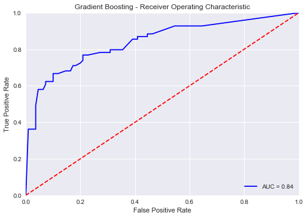


### Final Prediction


```python
algo = raw_input('Which Algorithm do you want to go with? (RF,GB,LR)')

if algo.upper() == 'RF':
    finalPredictionDF = (clfRF.predict(dfFinalTest_tree)).astype(int)
elif algo.upper() == 'GB':
    finalPredictionDF = (clfGB.predict(dfFinalTest_tree)).astype(int)
elif algo.upper() == 'LR':
    finalPredictionDF = (logmodel.predict(dfFinalTest_reg)).astype(int)
```

    Which Algorithm do you want to go with? (RF,GB,LR)gb
    


```python
dfTest['Survived'] = finalPredictionDF
kaggleSubmission = dfTest[['PassengerId','Survived']]
kaggleSubmission.to_csv('TitanicData.csv',header=True,index=False)
kaggleSubmission.head()
```


<div>
<style>
    .dataframe thead tr:only-child th {
        text-align: right;
    }

    .dataframe thead th {
        text-align: left;
    }

    .dataframe tbody tr th {
        vertical-align: top;
    }
</style>
<table border="1" class="dataframe">
  <thead>
    <tr style="text-align: right;">
      <th></th>
      <th>PassengerId</th>
      <th>Survived</th>
    </tr>
  </thead>
  <tbody>
    <tr>
      <th>0</th>
      <td>892</td>
      <td>0</td>
    </tr>
    <tr>
      <th>1</th>
      <td>893</td>
      <td>1</td>
    </tr>
    <tr>
      <th>2</th>
      <td>894</td>
      <td>0</td>
    </tr>
    <tr>
      <th>3</th>
      <td>895</td>
      <td>0</td>
    </tr>
    <tr>
      <th>4</th>
      <td>896</td>
      <td>1</td>
    </tr>
  </tbody>
</table>
</div>


```python

```
